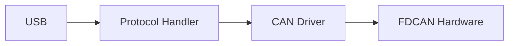

# MkDocs Documentation

This directory contains the source files for the PCAN-USB Pro FD documentation website, built with [MkDocs](https://www.mkdocs.org/) and the [Material for MkDocs](https://squidfunk.github.io/mkdocs-material/) theme.

## Building the Documentation

### Install Dependencies

```bash
pip install -r requirements.txt
```

Or install individually:
```bash
pip install mkdocs mkdocs-material mkdocs-minify-plugin pymdown-extensions
```

### Serve Locally

To preview the documentation locally:

```bash
mkdocs serve
```

Then open your browser to `http://127.0.0.1:8000`

### Build Static Site

To build the static HTML site:

```bash
mkdocs build
```

Output will be in the `site/` directory.

### Deploy to GitHub Pages

```bash
mkdocs gh-deploy
```

## Documentation Structure

```
docs/
├── index.md                    # Home page
├── getting-started/
│   ├── overview.md
│   ├── prerequisites.md
│   ├── installation.md
│   └── quickstart.md          # ✓ Created
├── hardware/
│   ├── specifications.md
│   ├── pinout.md
│   ├── clocks.md
│   └── schematics.md
├── build/
│   ├── instructions.md
│   ├── cmake.md
│   ├── flashing.md
│   └── debugging.md
├── software/
│   ├── architecture.md
│   ├── can-driver.md
│   ├── usb-protocol.md
│   ├── timestamp.md
│   └── leds.md
├── api/
│   ├── can.md
│   ├── usb.md
│   └── protocol.md
├── usage/
│   ├── can-config.md
│   ├── usb-comm.md
│   ├── testing.md
│   └── troubleshooting.md
├── development/
│   ├── code-style.md
│   ├── testing.md
│   └── releases.md
├── reference/
│   ├── license.md
│   └── acknowledgments.md
├── stylesheets/
│   └── extra.css              # ✓ Created
└── javascripts/
    └── extra.js               # ✓ Created
```

## Features

- **Material Theme**: Modern, responsive design
- **Dark/Light Mode**: Toggle between themes
- **Code Highlighting**: Syntax highlighting for multiple languages
- **Search**: Full-text search functionality
- **Navigation**: Tabbed navigation with sections
- **Mermaid Diagrams**: Support for flowcharts and diagrams
- **Admonitions**: Warning, info, and tip boxes
- **Code Copy**: One-click code copying

## Writing Documentation

### Admonitions

```markdown
!!! note "Optional Title"
    This is a note admonition.

!!! warning
    This is a warning.

!!! tip
    This is a helpful tip.
```

### Code Blocks

````markdown
```c
int main(void) {
    return 0;
}
```
````

### Mermaid Diagrams

````markdown

````

### Tables

```markdown
| Feature | Value |
|---------|-------|
| CPU | 480 MHz |
| RAM | 1 MB |
```

## Contributing

When adding new documentation:

1. Create markdown files in appropriate directories
2. Update `mkdocs.yml` navigation if needed
3. Test locally with `mkdocs serve`
4. Submit pull request

## Resources

- [MkDocs Documentation](https://www.mkdocs.org/)
- [Material for MkDocs](https://squidfunk.github.io/mkdocs-material/)
- [Markdown Guide](https://www.markdownguide.org/)
